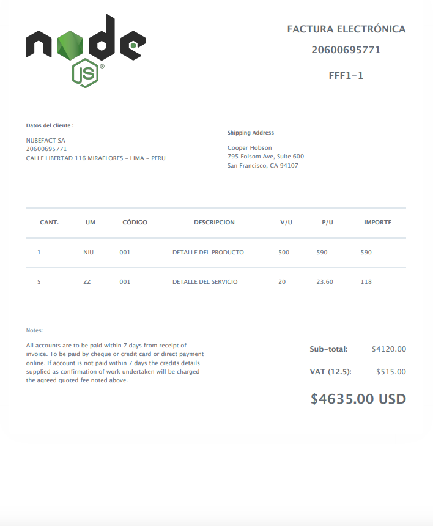

# API REST QUE GENERA UN PDF

_API REST que genera un PDF desde un JSON_

## UTILIZAMOS

_Node js , express , morgan , nodemon , html-pdf , babel_

### Para correr la aplicación 

```
npm run dev
```

## El PDF que generamos

 

## EL JSON que Usamos

```
{
   "operacion": "generar_comprobante",
   "tipo_de_comprobante": 1,
   "serie": "FFF1",
   "numero": "1",
   "sunat_transaction": 1,
   "cliente_tipo_de_documento": 6,
   "cliente_numero_de_documento": "20600695771",
   "cliente_denominacion": "NUBEFACT SA",
   "cliente_direccion": "CALLE LIBERTAD 116 MIRAFLORES - LIMA - PERU",
   "cliente_email": "",
   "cliente_email_1": "",
   "cliente_email_2": "",
   "fecha_de_emision": "18-09-2018",
   "fecha_de_vencimiento": "",
   "moneda": "1",
   "tipo_de_cambio": "",
   "porcentaje_de_igv": "18.00",
   "descuento_global": "",
   "total_descuento": "",
   "total_anticipo": "",
   "total_gravada": "600",
   "total_inafecta": "",
   "total_exonerada": "",
   "total_igv": "108",
   "total_gratuita": "",
   "total_otros_cargos": "",
   "total": "708",
   "percepcion_tipo": "",
   "percepcion_base_imponible": "",
   "total_percepcion": "",
   "total_incluido_percepcion": "",
   "detraccion": "false",
   "observaciones": "",
   "documento_que_se_modifica_tipo": "",
   "documento_que_se_modifica_serie": "",
   "documento_que_se_modifica_numero": "",
   "tipo_de_nota_de_credito": "",
   "tipo_de_nota_de_debito": "",
   "enviar_automaticamente_a_la_sunat": "true",
   "enviar_automaticamente_al_cliente": "false",
   "codigo_unico": "",
   "condiciones_de_pago": "",
   "medio_de_pago": "",
   "placa_vehiculo": "",
   "orden_compra_servicio": "",
   "tabla_personalizada_codigo": "",
   "formato_de_pdf": "",
   "items": [
         {
            "unidad_de_medida": "NIU",
            "codigo": "001",
            "descripcion": "DETALLE DEL PRODUCTO",
            "cantidad": "1",
            "valor_unitario": "500",
            "precio_unitario": "590",
            "descuento": "",
            "subtotal": "500",
            "tipo_de_igv": "1",
            "igv": "90",
            "total": "590",
            "anticipo_regularizacion": "false",
            "anticipo_documento_serie": "",
            "anticipo_documento_numero": ""
         }, {
            "unidad_de_medida": "ZZ",
            "codigo": "001",
            "descripcion": "DETALLE DEL SERVICIO",
            "cantidad": "5",
            "valor_unitario": "20",
            "precio_unitario": "23.60",
            "descuento": "",
            "subtotal": "100",
            "tipo_de_igv": "1",
            "igv": "18",
            "total": "118",
            "anticipo_regularizacion": "false",
            "anticipo_documento_serie": "",
            "anticipo_documento_numero": ""
         }
   ]
}
```